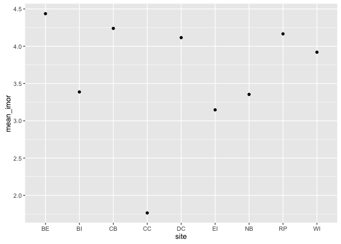

# purr_w_vegan


Load libraries

```r
library(purrr)
library(vegan)
library(ggplot2)
library(tidyr)
```

Load data

```r
div.data <- read.csv("~/div.data.csv")
```

Calculate I for each site, and plot

```r
div.data %>%
  split(div.data$site) %>% ## split into mini data frames by site
  map(~dispindmorisita(subset(.[4:33]), unique.rm = TRUE, na.rm = TRUE)) %>% ## apply I function
  map(., "imor") %>% ## select only the 'imor' parameter
  map(~mean(., na.rm = TRUE)) %>% ## calculate mean 'imor'
  as.data.frame() %>%
  gather("site", "mean_imor") %>% ## turn into long form for plotting purposes
  ggplot(aes(x = site, y= mean_imor)) + geom_point() ## and finally plot!
```

<!-- -->
